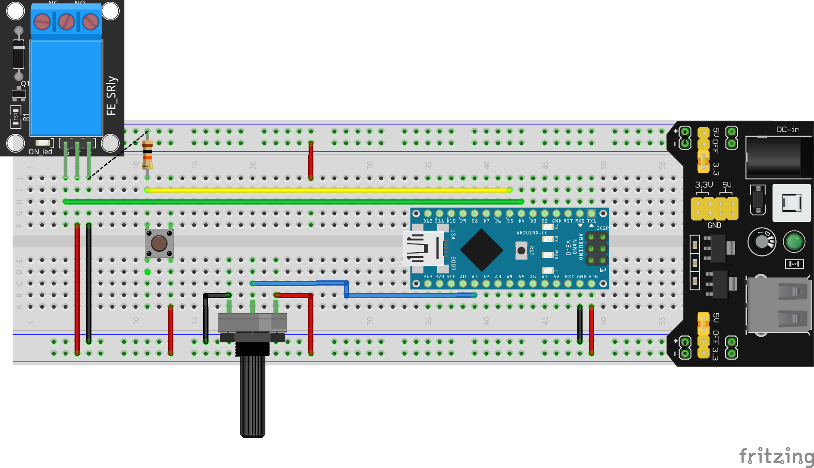

# Artificial-Breathing-Arduino-Art-Project
>Art project representing and organism breathing based on Arduino

## Hardware
Tested on:
- Arduino Uno
- Arduino Nano (had to solve driver problems with original board: [link](https://www.usb-drivers.org/ft232r-usb-uart-driver.html))

## Circuit Sketch

## Link to the exposition
*To be added*

## Contact
Email: <fortin@taltech.ee>
