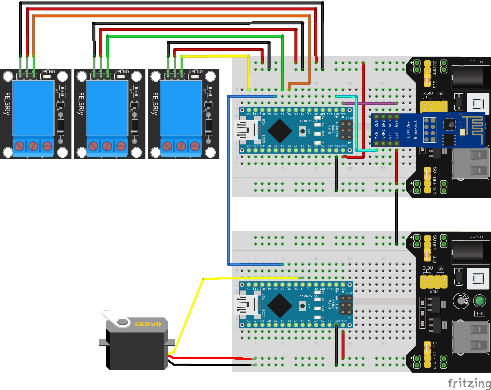

# Artificial-Breathing-Arduino-Art-Project
>Art project representing and organism breathing using Arduino. All the artistic part has been done by Juss Heinsalu

## Hardware
Finally the microcontrollers have been
- 2 Arduino Nano (had to solve driver problems with original board: [link](https://www.usb-drivers.org/ft232r-usb-uart-driver.html))
- ESP-01 (ESP8266)

## Scripts used
1. [arduino.ino](breathing-esp+arduino/arduino/arduino.ino)
2. [arduino2.ino](breathing-esp+arduino/arduino2/arduino2.ino)
3. [esp.ino](breathing-esp+arduino/esp/esp.ino)

First script is used for controlling the pump, vacuum pump and the big compressor (12V).
  
The second one is used to controlled the servo motor that serves as a valve for the "organism" 
connected to the compressor in order to regulate the out going air flow. The servo is controlled with a separate Arduino because of hardware constraints, power suppli couln't handle relays and servo at the same time.
  

The third is for serving as an interface for wirelessly set the parameters of the system: in time, pause, out time for each of the pump/compressor.

## Circuit Sketch
Everything is connected to a big power supply with enough amperage for all the motors.

## Unmounted system

## Part of the exhibition Taganemisteeta
[FB event](https://www.facebook.com/events/4201697879861242/?acontext=%7B"ref"%3A"52"%2C"action_history"%3A"[%7B%5C"surface%5C"%3A%5C"share_link%5C"%2C%5C"mechanism%5C"%3A%5C"share_link%5C"%2C%5C"extra_data%5C"%3A%7B%5C"invite_link_id%5C"%3A1373041676388522%7D%7D]"%7D)
[NART exhibition](https://www.nart.ee/en/exhibitions/nart-annual-exhibition-2021-point-of-no-return-attunement-of-attention/)

## Video of one of the organisms

## Contact
Email: <fortin@taltech.ee>
